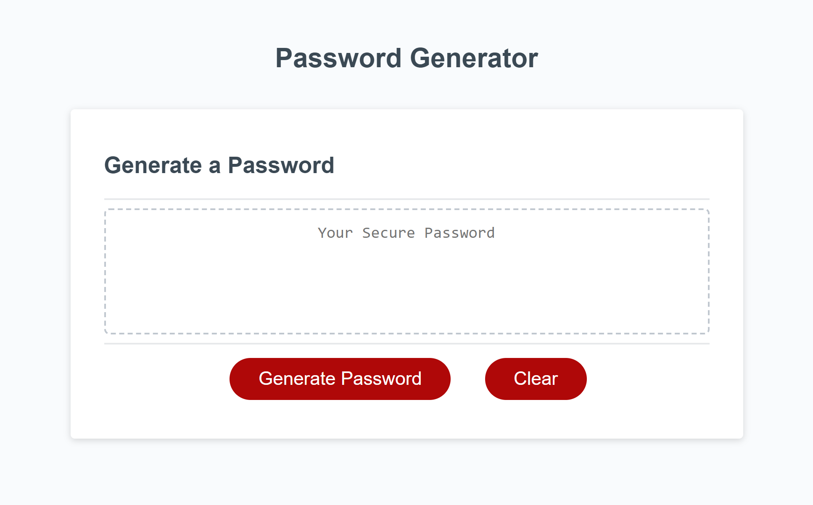
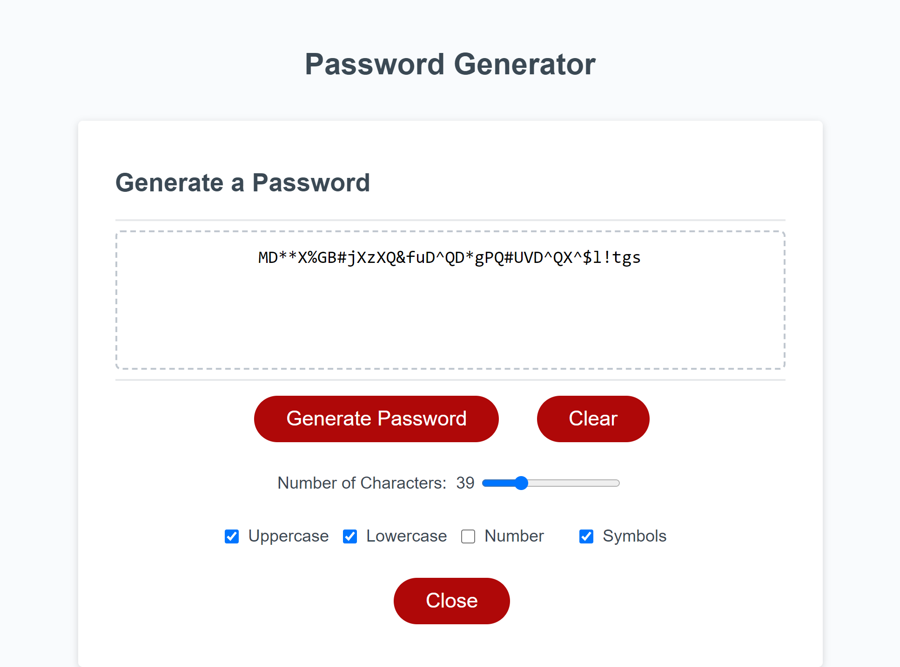

# js-random-password-generator
Random password generator built with JS HTML and CSS.
# Summary
This is a simple web-based password generator that allows users to create strong and secure passwords based on their preferences. Users can select various password criteria, such as uppercase letters, lowercase letters, numbers, and symbols, to customize the generated passwords. The generated password can be copied and used for various purposes, enhancing online security.

## Links to live page and repository
* Repository: https://github.com/Evan8383/js-random-password-generator
* Live Page: https://evan8383.github.io/js-random-password-generator/

## Features
### Customizable password criteria:
* Uppercase letters
* Lowercase letters
* Numbers
* Symbols
* Adjustable password length (between 8 and 128 characters).
* Clear button to remove the currently generated password.
* Interactive user interface.

## Usage
Clone or download the repository to your local machine.

Open the index.html file in your preferred web browser.

You will see the "Password Generator" interface, which includes the following elements:

Password criteria checkboxes for selecting the types of characters to include in the password.
A password length slider to specify the desired password length.
"Generate Password" button to generate a new password.
"Clear" button to clear the current password.
A text area to display the generated password.
Select the desired password criteria by checking the corresponding checkboxes.

Adjust the password length using the slider.

Click the "Generate Password" button to generate a password based on your criteria and length preferences. If no criteria are selected, you will receive an alert prompting you to choose at least one option.

The generated password will appear in the text area, and you can copy it for your use.

If you wish to generate another password with different criteria or length, simply repeat steps 4-6.

You can also use the "Clear" button to remove the current password from the text area.
## Screenshots



## User Story
```
AS AN employee with access to sensitive data
I WANT to randomly generate a password that meets certain criteria
SO THAT I can create a strong password that provides greater security
```

## Acceptance Criteria
```
GIVEN I need a new, secure password
WHEN I click the button to generate a password
THEN I am presented with a series of prompts for password criteria
WHEN prompted for password criteria
THEN I select which criteria to include in the password
WHEN prompted for the length of the password
THEN I choose a length of at least 8 characters and no more than 128 characters
WHEN asked for character types to include in the password
THEN I confirm whether or not to include lowercase, uppercase, numeric, and/or special characters
WHEN I answer each prompt
THEN my input should be validated and at least one character type should be selected
WHEN all prompts are answered
THEN a password is generated that matches the selected criteria
WHEN the password is generated
THEN the password is either displayed in an alert or written to the page
```
## File Structure
The project files are organized as follows:

* index.html: The main HTML file containing the structure of the web page.
* style.css: The stylesheet file for styling the web page elements.
* script.js: The JavaScript file containing the logic for generating passwords and handling user interactions.
## License
This project is licensed under the MIT License, which allows you to use and modify the code for both personal and commercial purposes. Please see the LICENSE file for more details.